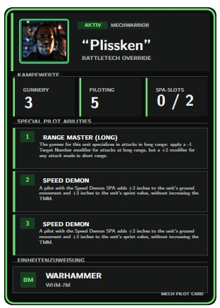

# BattleTech Override – Mech-Pilot-Karten



Mit dieser LaTeX-Vorlage können Mech-Pilot-Karten für **BattleTech Override** erstellt und gemeinsam auf einer A4-Seite gedruckt werden.

Eine Karte besitzt das Standard-Trading-Card-Format von **63,5 × 88,9 mm**. Auf eine A4-Seite passen maximal **neun Karten** in einem Raster aus drei Spalten und drei Reihen.

## Projektstruktur

```text
.
├── Bilder/
│   ├── Muster.jpg
│   └── plissken.png
├── main.tex
├── mechpilot_card.tex
├── kartenlayout.tex
├── spa_fertigkeiten.tex
├── vorlage1.tex
├── vorlage2.tex
├── vorlage3.tex
├── vorlage4.tex
├── vorlage5.tex
├── vorlage6.tex
├── vorlage7.tex
├── vorlage8.tex
├── vorlage9.tex
└── README.md
```

## Dateien

### `main.tex`

Erstellt einen A4-Druckbogen mit allen neun Karten.

Die Karten werden in einem Raster aus drei Spalten und drei Reihen angeordnet. Zwischen den Karten befindet sich ein Abstand von 3 mm, damit sie leichter ausgeschnitten werden können.

### `mechpilot_card.tex`

Erstellt eine einzelne Karte als Vorschau. Dabei wird standardmäßig `vorlage1.tex` verwendet.

### `kartenlayout.tex`

Enthält das gemeinsame Design aller Karten.

Änderungen an Farben, Abständen, Schriftgrößen oder der Anordnung müssen nur in dieser Datei vorgenommen werden.

### `spa_fertigkeiten.tex`

Enthält den gemeinsamen Katalog aller Special Pilot Abilities mit Namen, Mindestslot und Beschreibung.

### `vorlage1.tex` bis `vorlage9.tex`

Enthalten die individuellen Daten der neun Karten.

Jede Vorlage kann unabhängig bearbeitet werden.

## Karte bearbeiten

Die Daten einer Karte werden in der jeweiligen `vorlageX.tex` eingetragen.

Beispiel für `vorlage1.tex`:

```latex
% =============================================================================
% KARTE 1
% Nur die Werte in dieser Datei anpassen.
% =============================================================================

\begingroup

\def\PilotName{Plissken}
\def\PilotStatus{AKTIV}
\def\PilotRole{MECHWARRIOR}
\def\PilotImage{Bilder/plissken.png}

\def\Gunnery{3}
\def\Piloting{5}
\def\SPASlots{0 / 3}

% Fertigkeiten aus spa_fertigkeiten.tex
\def\AbilityOne{\RangeMasterLong}
\def\AbilityTwo{\SpeedDemon}
\def\AbilityThree{}

\def\AssignedUnit{WARHAMMER}
\def\AssignedVariant{WHM-7M}

\MechPilotCard

\endgroup
```

## Profilbilder

Profilbilder werden im Ordner `Bilder` gespeichert.

Beispiel:

```text
Bilder/plissken.png
```

Der Bildpfad wird anschließend in der gewünschten Kartenvorlage eingetragen:

```latex
\def\PilotImage{Bilder/plissken.png}
```

Unterstützt werden beispielsweise:

```text
.png
.jpg
.jpeg
.pdf
```

Fehlt die angegebene Datei, erscheint auf der Karte automatisch ein Platzhalter.

## Special Pilot Abilities

Jede Karte besitzt drei sichtbare Fertigkeitsslots:

```latex
\def\AbilityOne{}
\def\AbilityTwo{}
\def\AbilityThree{}
```

Wird keine Fertigkeit ausgewählt, bleibt das jeweilige Feld leer. Der Rahmen und die Slotnummer bleiben trotzdem sichtbar.

### Drei belegte Slots

```latex
\def\AbilityOne{\RangeMasterLong}
\def\AbilityTwo{\SpeedDemon}
\def\AbilityThree{\Sniper}
```

### Nur ein belegter Slot

```latex
\def\AbilityOne{\Dodge}
\def\AbilityTwo{}
\def\AbilityThree{}
```

### Keine belegten Slots

```latex
\def\AbilityOne{}
\def\AbilityTwo{}
\def\AbilityThree{}
```

Nicht verwendete Definitionen können auch vollständig weggelassen werden, da leere Standardwerte in `kartenlayout.tex` hinterlegt sind.

Beispiel:

```latex
\def\AbilityOne{\RangeMasterLong}
```

In diesem Fall bleiben Slot 2 und Slot 3 automatisch leer.

## Verfügbare Fertigkeiten

### Ab Slot 1

```latex
\BloodStalker
\ClusterHitter
\Dodge
\EaglesEyes
\EnvironmentalSpecialist
\ForwardObserver
\ManeuveringAce
\MeleeMaster
\MeleeSpecialist
\MultiTasker
\RangeMasterExtreme
\RangeMasterLong
\RangeMasterMedium
\StandAside
```

### Ab Slot 2

```latex
\Hopper
\JumpingJack
\Marksman
\SpeedDemon
\Swordsman
```

### Ab Slot 3

```latex
\HotDog
\NaturalGrace
\ObliqueAttacker
\Sniper
```

Die Zuordnung „Ab Slot“ bedeutet, wie viele SPA-Slots der Pilot mindestens benötigt, um die entsprechende Fertigkeit auswählen zu können.

## Neue Fertigkeit hinzufügen

Neue Fertigkeiten werden in `spa_fertigkeiten.tex` nach folgendem Schema ergänzt:

```latex
\DeclareSPA
  {Kurzname}
  {Mindestslot}
  {Anzeigename}
  {Beschreibung}
```

Beispiel:

```latex
\DeclareSPA{BeispielFertigkeit}{2}{Beispiel-Fertigkeit}{%
Hier steht die vollständige Beschreibung der neuen Fertigkeit.%
}
```

Die neue Fertigkeit kann danach in einer Kartenvorlage über ihren Kurznamen ausgewählt werden:

```latex
\def\AbilityTwo{\BeispielFertigkeit}
```

Der Kurzname darf keine Leerzeichen oder Sonderzeichen enthalten.

Beispiele:

```text
Range Master (Long) → RangeMasterLong
Eagle's Eyes        → EaglesEyes
Multi-Tasker        → MultiTasker
```

## A4-Druckbogen erstellen

Im Projektordner folgenden Befehl ausführen:

```bash
pdflatex main.tex
```

Dadurch wird die Datei erzeugt:

```text
main.pdf
```

Sie enthält alle neun Karten auf einer A4-Seite.

## Einzelkarte erstellen

Für eine Vorschau von `vorlage1.tex`:

```bash
pdflatex mechpilot_card.tex
```

Dadurch wird die Datei erzeugt:

```text
mechpilot_card.pdf
```

## Drucken

Beim Drucken müssen folgende Einstellungen verwendet werden:

- Papierformat: **A4**
- Skalierung: **100 %**
- Einstellung: **Tatsächliche Größe**
- Automatische Seitenanpassung: **deaktiviert**

Optionen wie „An Seite anpassen“, „Verkleinern“ oder „Übergroße Seiten anpassen“ dürfen nicht aktiviert sein. Andernfalls stimmt das Kartenformat von 63,5 × 88,9 mm nicht mehr.

## Musterbild ändern

Das Bild unter der Überschrift dieser README liegt unter:

```text
Bilder/Muster.jpg
```

Es kann durch ein anderes Bild ersetzt werden, solange Dateiname und Pfad gleich bleiben.

Alternativ kann der Pfad am Anfang dieser README geändert werden:

```markdown

```